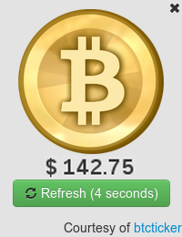

BitTicker
=========

A simple node-webkit based bitcoin exchange ticker

Installation
============
For Linux:

1. Download Master Branch of Repo as Zip (assuming /tmp/BitTicker-master.zip)
2. Move contents in BitTicker-master folder of Zip Archive to root of Zip
3. concat nw command and zip by running cat /usr/lib/node-webkit/nw /tmp/BitTicker-master.zip > /usr/lib/node-webkit/BitTicker
4. chmod +x /usr/lib/node-webkit/BitTicker
